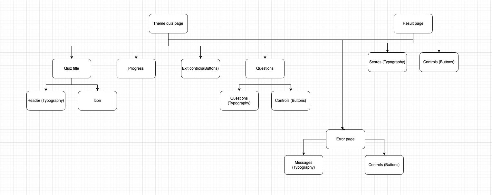
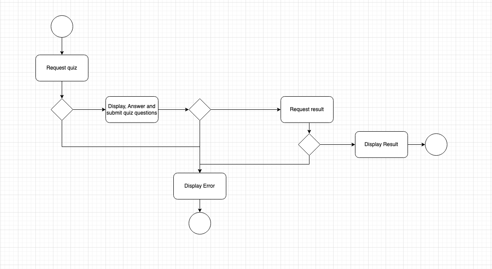

# Quiz Application

- ### About :
This application is static, developed with React, redux and backend is served using Postman. Application is hosted on 
Amazon S3 and can be reached [HERE](http://reactquizapp.s3-website.eu-north-1.amazonaws.com/)

- ### Clean code : 
I followed a component-based architecture, ensuring clear separation of concerns by breaking the UI into small, 
reusable, and self-contained components. All components were named consistently and descriptively, 
adhering to both the DRY (Don't Repeat Yourself) principle and the Single Responsibility Principle.

Additionally, error handling was implemented to be graceful, providing clear and concise messages to users. I ensured 
code consistency by using ESLint for enforcing a consistent coding style and Prettier for automatic formatting, making 
the codebase more maintainable and readable.

- ### Unit testing :
I utilized @testing-library/react, the default testing library for React applications, to verify that all components 
render correctly and behave as expected. Each component was tested to ensure that key elements are rendered as required,
ensuring reliability and functionality.

- ### Routing :
I utilized React Router to manage seamless client-side navigation, ensuring an intuitive and smooth user experience 
across different views and components.

- ### State management :
I implemented Redux, Redux Toolkit, and React Hooks to efficiently manage global state, ensuring that shared data is 
consistently available across views and components. This approach simplifies state management, improves scalability, 
and enhances maintainability.

- ### Bearer token simulation :
In the RTK Query API file, I implemented request authorization by attaching a dummy token to the authorization headers.
This ensures that each request is authenticated, simulating real-world API interaction securely and efficiently.

- ## Getting started :
- Unzip the Package: Use any file extraction tool of your choice to unzip the package.
- Navigate to the Project Directory: From within the project's directory, run the following command to install the 
necessary dependencies:
- Install dependencies ```npm install```
- Run the application ```npm start```
- Test the application ```npm test```

Alternatively, you can use the provided deployment bash script: ```./deploy.sh``` , this script will install serve if not
installed already, install dependencies, build the app, run included tests and serve the build to http://localhost:3000/.
- NOTE: Please ensure that the port 3000 is free.

## Folder structure

- **quiz-app/**
    - **src/**
        - **assets/**
            - `Images and fonts`
        - **components/**
            - `All components`
          - **hooks/**
              - `Hooks`
          - **pages/**
              - `Views`
          - **redux/**
              - `Redux store and API`
          - **tests/**
              - **components/**
                - `Components tests`
          - **types/**
              - `Typescript types`
    - **public/**
        - `Public files`

## Architectural diagrams (Some boxes I came up with in my thought process)

- ## Components structure :
This diagram outlines the key components and their corresponding UI element dependencies.


- ## User flow :
This diagram illustrates the flow of data and user interactions throughout the application, from loading the quiz page 
to viewing the results. It also highlights potential error points along the way.
